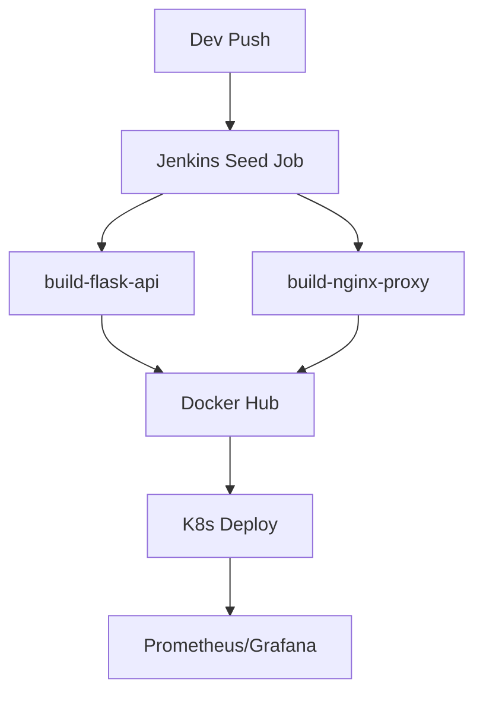
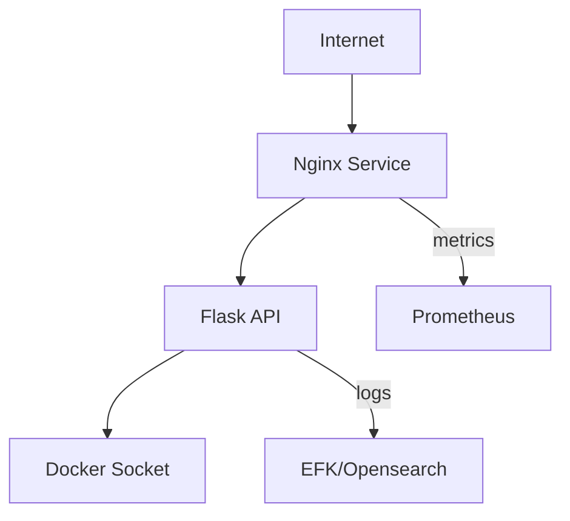

# 📐 CI/CD + DevSecOps Project Architecture

## 1. General Scheme

- User → Nginx (reverse proxy) → Flask API
- All services are containerized (Docker)
- Deployment in Kubernetes (minikube/dev/prod)
- Automation via Jenkins (Job DSL) and scripts
- Autoscaling via KEDA

## 2. CI/CD Pipeline

- Jenkins Seed Job generates pipelines:
  - build-flask-api (Docker build/push)
  - build-nginx-proxy (Docker build/push)
  - runner-job (local integration test)
- Checks: lint, tests, security scan (Trivy/Dockle — recommended)
- Deployment to Kubernetes via kubectl/Helm

## 3. Security

- Containers non-root, drop capabilities, read-only rootfs (Nginx)
- RBAC, NetworkPolicy, resource quotas, namespace isolation
- Secrets via Kubernetes Secrets (Vault — recommended)
- Admission control (OPA/Kyverno — recommended)
- Image scanning (Trivy, Dockle — recommended)

## 4. Observability

- Health endpoints, probes
- Prometheus + Grafana (Helm chart, automation — see below)
- Alertmanager for metric alerts
- Logging: stdout + shipping to EFK/Opensearch (recommended)
- Distributed tracing: Jaeger/Tempo (recommended)

## 5. Disaster Recovery & Runbooks

- Backup/restore: PVC, etcd, images, configs (see RUNBOOKS.md)
- Rollback: kubectl rollout undo, Helm rollback
- Troubleshooting: kubectl logs, describe, events, Prometheus/Grafana

## 6. Architecture Diagrams

- [x] CI/CD Scheme (see diagram below)
- [x] Network interaction scheme (see diagram below)
- [x] Security scheme (see diagram below)

---

## Mermaid Diagrams

### CI/CD Pipeline


### Network Architecture


### Security
```mermaid
graph TD
  user[User] --> nginx[Nginx (non-root, read-only)]
  nginx --> flask[Flask API (non-root)]
  flask --> k8s[K8s RBAC, NetworkPolicy]
  k8s --> vault[Vault/Secrets]
  k8s --> opa[OPA/Kyverno]
```

---

## See more in files:
- [RUNBOOKS.md](RUNBOOKS.md) — instructions for recovery, update, troubleshooting
- [MONITORING.md](MONITORING.md) — Prometheus/Grafana/Alertmanager installation, log shipping, alerts
- [LOGGING.md](LOGGING.md) — centralized logging setup
- [TRACING.md](TRACING.md) — distributed tracing implementation 